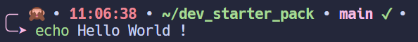

[]() 




Site : https://ohmyz.sh/

Installation sur Debian:  

- Fichier de configuration : ~/.zshrc
- Dossier de plugins: ~/.oh-my-zsh/custom/plugins


## Theme


*Dans .oh-my-zsh\themes*

Créer un fichier speaknoevilmonkey.zsh-theme et coller dedans le code suivant:

```bash	
ZSH_THEME_GIT_PROMPT_PREFIX=""
ZSH_THEME_GIT_PROMPT_SUFFIX=""
ZSH_THEME_GIT_PROMPT_DIRTY="$fg_bold[red] ✗"
ZSH_THEME_GIT_PROMPT_CLEAN="$fg_bold[green] ✓"

local time='%{$fg_bold[red]%}%*%{$reset_color%}%{$reset_color%}'
local current_directory='%{$fg_bold[green]%}%3~%{$reset_color%}'
local git_branch='%{$fg_bold[magenta]%}$(git_prompt_info)%{$reset_color%}'
local ram_available="$(free -h | awk '/^Mem:/ {print $7}')"
local python_env='%{$fg_bold[yellow]%}${VIRTUAL_ENV:t}%{$reset_color%}'

PROMPT="%{$fg_bold[magenta]%}╭─%{$reset_color%} 🙊 • ${time} • ${current_directory} • ${git_branch} • ${python_env}
%{$fg_bold[magenta]%}╰─➤%{$reset_color%} "
```

Puis dans *Dans ~/.zshrc*

```bash
ZSH_THEME="speaknoevilmonkey"
```
```
## Plugins

*Dans ~/.zshrc*

```bash
source ~/.oh-my-zsh/catppuccin_macchiato-zsh-syntax-highlighting.zsh

plugins=(
	zsh-autosuggestions
	zsh-syntax-highlighting
)
```

- catppucin for zsh-syntax-highlighting

    [Repository Github](https://github.com/catppuccin/zsh-syntax-highlighting)

    Il faut juste coller le fichier .zsh dans le dossier ~/.oh-my-zsh)


- zsh-syntax-highlighting
    ```bash
    git clone https://github.com/zsh-users/zsh-syntax-highlighting.git ${ZSH_CUSTOM:-~/.oh-my-zsh/custom}/plugins/zsh-syntax-highlighting
    ```


- zsh-autosuggestions

    ```bash
    git clone https://github.com/zsh-users/zsh-autosuggestions ${ZSH_CUSTOM:-~/.oh-my-zsh/custom}/plugins/zsh-autosuggestions
    ```

## Alias

*Dans ~/.zshrc*

```bash
# GIT
gc() {
    git add .
    git commit -m "$1"
}
gca() {
    git add .
    git commit --amend
}
gr() { 
    if [ -n "$1" ]; then
        git fetch origin/$1
        git rebase origin/$1
    else
        echo "specify a branch name for git rebase"
    fi
}
gri() { 
    if [ -n "$1" ]; then
        git fetch origin/$1
        git rebase -i origin/$1
    else
        echo "specify a branch name for git rebase -i"
    fi
}


alias gp='git push'
gpf() {
    echo -n "Êtes-vous sûr de vouloir effectuer un git push --force? (y/n)"
    read reponse
    if [[ $reponse == [yY] ]]; then
        git push --force-with-lease
    else
        echo "Opération annulée."
    fi
}

alias gra='git rebase --abort'
alias grc='git rebase --continue'
# DOCKER
alias dcd='docker compose down'
alias dcu='docker compose up'
alias ddcu='FLASK_DEBUG=1 docker compose up'
# NPM
alias ns='npm start'
```
