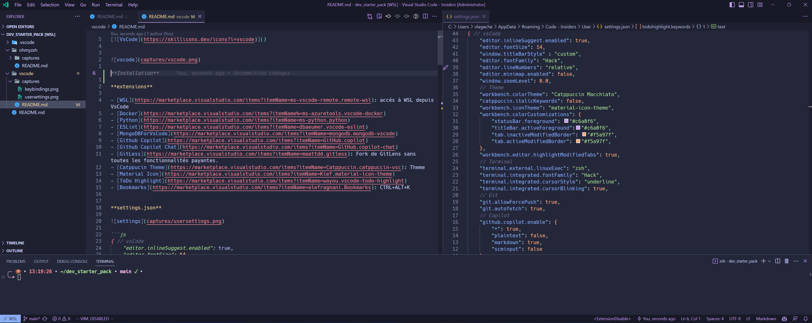
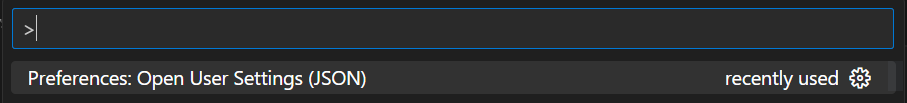
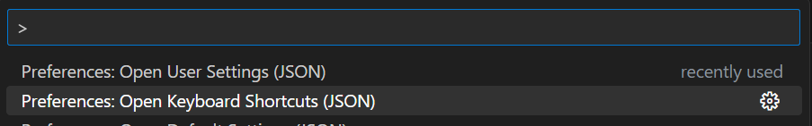

[]()




**extensions** 

- [WSL](https://marketplace.visualstudio.com/items?itemName=ms-vscode-remote.remote-wsl): accés à WSL depuis VsCode
- [Docker](https://marketplace.visualstudio.com/items?itemName%=ms-azuretools.vscode-docker)
- [Python](https://marketplace.visualstudio.com/items?itemName=ms-python.python)
- [ESLint](https://marketplace.visualstudio.com/items?itemName=dbaeumer.vscode-eslint)
- [MongoDBForVsCode](https://marketplace.visualstudio.com/items?itemName=mongodb.mongodb-vscode)
- [Github Copilot](https://marketplace.visualstudio.com/items?itemName=GitHub.copilot)
- [Github Copilot Chat](https://marketplace.visualstudio.com/items?itemName=GitHub.copilot-chat)
- [GitLess](https://marketplace.visualstudio.com/items?itemName=maattdd.gitless): Fork de GitLens sans toutes les fonctionnalités payantes.
- [Catppucin Theme](https://marketplace.visualstudio.com/items?itemName=Catppuccin.catppuccin-vsc): Theme
- [Material Icon](https://marketplace.visualstudio.com/items?itemName=Kief.material-icon-theme)
- [ToDo Highlight](https://marketplace.visualstudio.com/items?itemName=wayou.vscode-todo-highlight)
- [Bookmarks](https://marketplace.visualstudio.com/items?itemName=alefragnani.Bookmarks): CTRL+ALT+K
- [resourcemonitor](https://marketplace.visualstudio.com/items?itemName%253Dmutantdino.resourcemonitor)
- [VsCodeVim](https://marketplace.visualstudio.com/items?itemName=vscodevim.vim)
- [NERDTree](https://marketplace.visualstudio.com/items?itemName=Llam4u.nerdtree)

**settings.json**



```js
{ // vsCode
    "editor.inlineSuggest.enabled": true,
    "editor.fontSize": 14,
    "window.titleBarStyle": "custom",
    "editor.fontFamily": "Hack",
    "editor.lineNumbers": "relative",
    "editor.minimap.enabled": false,
    "workbench.tree.indent": 15,
    "editor.renderWhitespace": "trailing",
    "editor.rulers": [
        140
    ],
    // theme
    "workbench.colorTheme": "Catppuccin Macchiato",
    "catppuccin.italicKeywords": false,
    "workbench.iconTheme": "material-icon-theme",
    "workbench.colorCustomizations": {
        "statusBar.foreground": "#c6a0f6",
        "titleBar.activeForeground": "#c6a0f6",
        "tab.inactiveModifiedBorder": "#f5a97f",
        "tab.activeModifiedBorder": "#f5a97f",
    },
    "workbench.editor.highlightModifiedTabs": true,
    // Terminal
    "terminal.external.linuxExec": "zsh",
    "terminal.integrated.fontFamily": "Hack",
    "terminal.integrated.cursorStyle": "underline",
    "terminal.integrated.cursorBlinking": true,
    // Git
    "git.allowForcePush": true,
    "git.autofetch": true,
    // Copilot 
    "github.copilot.enable": {
        "*": true,
        "plaintext": false,
        "markdown": true,
        "scminput": false
    },
    // TODO Highlight
    // https://github.com/catppuccin/catppuccin for colors.
    "todohighlight.isEnable": true,
    "todohighlight.keywords": [
        {
            "text": "DEBUG:",
            "color": "#ffffff",
            "backgroundColor": "#c6a0f6",
        },
        {
            "text": "TODO:",
            "color": "#ffffff",
            "backgroundColor": "#ed8796",
        }
    ],
    // bookmarks
    "bookmarks.gutterIconFillColor": "#f5a97f",
    "bookmarks.gutterIconBorderColor": "#d47c00",
    // vim
    "vim.neoVimPath": "/usr/bin/nvim",
    "vim.enableNeovim": true,
    "vim.leader": "<Space>",
    "vim.handleKeys": {
        "<C-n>": false,
    },
    "vim.useSystemClipboard": true,
    "vim.normalModeKeyBindingsNonRecursive": [
        // Navigation between onglets 
        { "before": ["<C-Left>"], "commands": [":bprevious"] },
        { "before": ["<C-Right>"], "commands": [":bnext"] },
        // Navigation file
        { "before": ["<S-l>"], "after": ["$"] },
        { "before": ["<S-h>"], "after": ["^"] }, 
        // splits
        { "before": ["leader", "v"], "commands": [":vsplit"] },
        { "before": ["leader", "s"], "commands": [":split"] },
        // panes
        {
            "before": ["leader", "h"],
            "commands": ["workbench.action.focusLeftGroup"]
        },
        {
            "before": ["leader", "j"],
            "commands": ["workbench.action.focusBelowGroup"]
        },
        {
            "before": ["leader", "k"],
            "commands": ["workbench.action.focusAboveGroup"]
        },
        {
            "before": ["leader", "l"],
            "commands": ["workbench.action.focusRightGroup"]
        },
        // extension Bookmarks
        {
            "before": ["leader", "b"],
            "commands": ["bookmarks.toggle"]
        }
    ],
    "vim.insertModeKeyBindingsNonRecursive": [
        {"before": ["j", "k"], "after": ["<ESC>"]}
    ],
    "vim.visualModeKeyBindings": [
        // Stay in visual mode while indenting
        { "before": ["<"], "commands": ["editor.action.outdentLines"] },
        { "before": [">"], "commands": ["editor.action.indentLines"] },
    ],
    // Format
    "json.format.enable": false,
    // ressource monitor 
    "resmon.show.cpufreq": false,
    "python.languageServer": "Pylance",
}
```




```js
[
    // Vim Extension Enable/Disable
    {
        "key": "ctrl+shift+v",
        "command": "toggleVim"
    },
    // Terminal
    {
        "key": "ctrl+space",
        "command": "workbench.action.terminal.toggleTerminal",
    },
    {
        "key": "ctrl+n",
        "command": "workbench.action.terminal.new",
        "when": "terminalFocus"
    },
    // Right Side Bar action
    {
        "key": "ctrl+b",
        "command": "workbench.action.toggleActivityBarVisibility"
    },
    // Size Windows
    {
        "key": "ctrl+x",
        "command": "workbench.action.increaseViewWidth"
    },
    {
        "key": "ctrl+w",
        "command": "workbench.action.decreaseViewWidth",
    },
]

``` 

**Ressources** :

- [Basic shortcuts](https://code.visualstudio.com/shortcuts/keyboard-shortcuts-windows.pdf)
- [Hack Font](https://sourcefoundry.org/hack/)